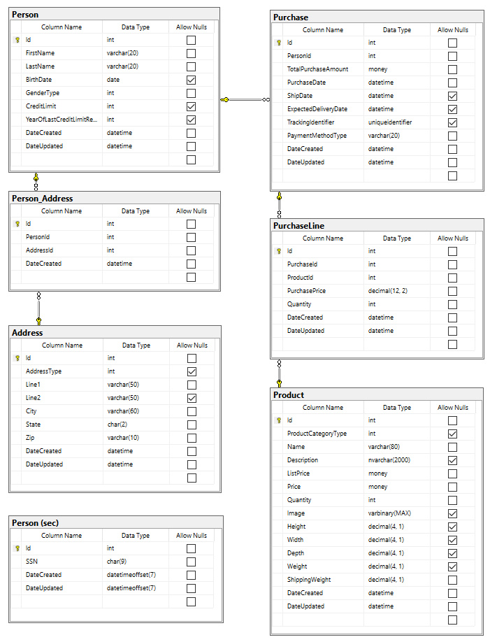

# Unit Testing

Unit tests are implemented using [xUnit](https://xunit.net/), with [FluentAssertions](https://fluentassertions.com/) providing a more readable approach to assertions within tests.  The tests in this project are
technically integration tests, as they execute against a specific MSSQL platform.  The intent of tests in this project is to test that statements executed against the database produce data sets as
expected.

While the database includes 2 schemas (```dbo``` and ```sec```), ```sec``` includes only 1 table and does not have any populated data and is therefore not referenced again in this document.  ```sec``` schema is rarely used
in unit tests, generally only to test that DbExpression supports multiple schemas.

Unit tests in this project extend a base class that executes [```data.sql```](data.sql) prior to every test, which flushes all data from the database and re-populates.  This ensures tests can run in any order, are not dependent 
upon each other, and have a consistent and known set of data prior to execution.

## dbo Schema

**The schema does not necessarily reflect how one should design and implement the domain model expressed through the schema; the model is simply one that works well for testing statement execution.**
All tables have an ```Id``` column, and use ```Identity(1,1)``` as the data type.



The populated data ([```data.sql```](data.sql)) produces the following counts/metrics that are available for use in assertions:
- Person
	- 50 records
	- 15 have no address
	- 18 have 1 address
	- 17 have 2 addresses	
- Address
	- 32 records
	- 4 have 'Shipping' address type
	- 28 have 'Billing' address type
	- 0 have 'Mailing' address type	
	- 1 address is associated with 14 persons, all different
	- 3 addresses are associated with 3 persons, all different
	- 28 addresses are associated to 1 person, all different
- Product
	- 9 records
	- 1 product has no category type
	- 2 have 'Toys and Games' product category type
	- 3 have 'Electronics' product category type
	- 3 have 'Books' product category type
	- product ids 3, 6, 9 have no purchases (each in a different category type)
- Purchase
	- 15 records
	- 3 have 1 item and quantity of 1
	- 3 have 1 item and quantity of 2
	- 1 has 3 items, all with quantity of 1
	- 1 has 2 items, all with quantity of 3
	- 7 have 1 item, with purchase prices different from the current product price
		- 5 with purchase price less than current product price
		- 2 with purchase price greater than current product price
	- 12 purchases have shipped
	- 8 purchases have expected delivery dates
	- 4 purchases have tracking identifiers
	- 6 have 'CreditCard' payment method
	- 5 have 'PayPal' payment method
	- 4 have 'ACH' payment method
	- 7 have 'Web' payment source
	- 4 have 'InPerson' payment source
	- 4 have no payment source
	
## dbo Schema Tables

The data populated in each table (except Person_Address which can be inferred) available for use in test assertions:

### Person
|   Id  |   First Name  |   Last Name       |   Gender     	|   Birth Date  |	Credit Limit	|	Year of Last Credit Limit Review	|   Date Created    |   Date Updated	|   Addresses   |   Purchases  	|
|-------|---------------|-------------------|---------------|---------------|------------------:|---------------------------------------|-------------------|-------------------|---------------|---------------|
|	1	|	Kenny		|	McCormick 		|	Male		|	1/1/1996	|	10000			|	2016								|	1/1/2017		|	1/1/2018		|				|				|
|	2	|	Butters		|	Stotch    		|	Male		|	2/1/1996	|	10000			|	2016								|	1/1/2017		|	2/1/2018		|	2			|	1, 7, 10	|
|	3	|	Kyle		|	Broflovski		|	Male		|	3/1/1996	|	10000			|	2016								|	1/1/2017		|	3/1/2018		|	1, 3		|	2, 8, 11	|
|	4	|	Bebe		|	Stevens   		|	Female		|	4/1/1996	|	10000			|	2016								|	1/1/2017		|	4/1/2018		|				|				|
|	5	|	Wendy		|	Testaburge		|	Female		|	5/1/1996	|	10000			|	2016								|	1/1/2017		|	5/1/2018		|	4			|				|
|	6	|	Stan		|	Marsh     		|	Male		|	6/1/1996	|	10000			|	2016								|	1/1/2017		|	6/1/2018		|	1, 5		|	3, 9, 12	|
|	7	|	Jimmy		|	Valmer    		|	Male		|	7/1/1996	|	10000			|	2016								|	1/1/2017		|	7/1/2018		|				|				|
|	8	|	Clyde		|	Donovan   		|	Male		|	8/1/1996	|	10000			|	2016								|	1/1/2017		|	8/1/2018		|	6			|				|
|	9	|	Eric		|	Cartman			|	Male		|	9/1/1996	|	10000			|	2016								|	1/1/2017		|	9/1/2018		|	1, 7		|	4, 13		|
|	10	|	Craig		|	Tucker    		|	Male		|	10/1/1996	|	10000			|	2016								|	1/1/2017		|	10/1/2018		|				|				|
|	11	|	Timmy		|	Burch     		|	Male		|	1/1/1996	|	10000			|	2016								|	1/1/2017		|	1/1/2018		|	8			|				|
|	12	|	Scott		|	Malkinson 		|	Male		|	2/1/1996	|	20000			|	2016								|	1/1/2017		|	2/1/2018		|	1, 9		|	5, 14		|
|	13	|	Heidi		|	Turner    		|	Female		|	3/1/1996	|	20000			|	2016								|	1/1/2017		|	3/1/2018		|				|				|
|	14	|	Nichole		|	Daniels   		|	Female		|	4/1/1996	|	20000			|	2016								|	1/1/2017		|	4/1/2018		|	10			|				|
|	15	|	Annie		|	Knitts    		|	Female		|	5/1/1996	|	20000			|	2016								|	1/1/2017		|	5/1/2018		|	1, 11		|	6, 15		|
|	16	|	Bradley		|	Biggle    		|	Male		|	7/1/1996	|	20000			|	2016								|	1/1/2017		|	7/1/2018		|				|				|
|	17	|	David		|	Rodriguez 		|	Male		|	8/1/1996	|	20000			|	2016								|	1/1/2017		|	8/1/2018		|	12			|				|
|	18	|	Jason		|	White     		|	Male		|	9/1/1996	|	20000			|	2016								|	1/1/2017		|	9/1/2018		|	1, 13		|				|
|	19	|	Jenny		|	Simons    		|	Female		|	10/1/1996	|	20000			|	2016								|	1/1/2017		|	10/1/2018		|				|				|
|	20	|	Kevin		|	Stoley    		|	Male		|	1/1/1996	|	20000			|	2016								|	1/1/2017		|	1/1/2018		|	14			|				|
|	21	|	Leroy		|	Mullins   		|	Male		|	2/1/1996	|	20000			|	2016								|	1/1/2017		|	2/1/2018		|	1, 15		|				|
|	22	|	Marcus		|	Preston   		|	Male		|	3/1/1996	|	30000			|										|	1/1/2017		|	3/1/2018		|				|				|
|	23	|	Millie		|	Larson    		|	Female		|	4/1/1996	|	30000			|										|	1/1/2017		|	4/1/2018		|	16			|				|
|	24	|	Pip			|	Pirrup    		|	Male		|	5/1/1996	|	30000			|										|	1/1/2017		|	5/1/2018		|	1, 17		|				|
|	25	|	Powder		|	Turner    		|	Female		|	6/1/1996	|	30000			|										|	1/1/2017		|	6/1/2018		|				|				|
|	26	|	Adam		|	Borque    		|	Male		|	7/1/1996	|	30000			|										|	1/1/2017		|	7/1/2018		|	18			|				|
|	27	|	Alex		|	Glick     		|	Male		|	8/1/1996	|	30000			|										|	1/1/2017		|	8/1/2018		|	1, 19		|				|
|	28	|	Allen		|	Varcas    		|	Male		|	9/1/1996	|	30000			|										|	1/1/2017		|	9/1/2018		|				|				|
|	29	|	Allie		|	Nelson    		|	Female		|	10/1/1996	|	30000			|										|	1/1/2017		|	10/1/2018		|	20			|				|
|	30	|	Baahir		|	Hakeem    		|	Male		|	1/1/1996	|	30000			|										|	1/1/2017		|	1/1/2018		|	1, 21		|				|
|	31	|	Bill		|	Allen     		|	Male		|	2/1/1996	|	30000			|										|	1/1/2017		|	2/1/2018		|				|				|
|	32	|	Billy		|	Circlovich		|	Male		|	3/1/1996	|	40000			|										|	1/1/2017		|	3/1/2018		|	22			|				|
|	33	|	Billy		|	Miller    		|	Male		|	4/1/1996	|	40000			|										|	1/1/2017		|	4/1/2018		|	1, 23		|				|
|	34	|	Chris		|	Donnely   		|	Male		|	5/1/1996	|	40000			|										|	1/1/2017		|	5/1/2018		|				|				|
|	35	|	Damien		|	Thorn     		|	Male		|	6/1/1996	|	40000			|										|	1/1/2017		|	6/1/2018		|	24			|				|
|	36	|	Daniel		|	Tanner    		|	Male		|	7/1/1996	|	40000			|										|	1/1/2017		|	7/1/2018		|	1, 25		|				|
|	37	|	David		|	Weatherhea		|	Male		|	8/1/1996	|	40000			|										|	1/1/2017		|	8/1/2018		|				|				|
|	38	|	Davin		|	Miller    		|	Male		|	9/1/1996	|	40000			|										|	1/1/2017		|	9/1/2018		|	26			|				|
|	39	|	Emily		|	Marx      		|	Female		|	10/1/1996	|	40000			|										|	1/1/2017		|	10/1/2018		|	1, 27		|				|
|	40	|	Emmett		|	Hollis    		|	Male		|	1/1/1997	|	40000			|										|	1/1/2017		|	1/1/2018		|				|				|
|	41	|	Estella		|	Havesham  		|	Female		|	2/1/1997	|	40000			|										|	1/1/2017		|	2/1/2018		|	28			|				|
|	42	|	Fosse		|	O'Donnelle  	|	Male		|	3/1/1997	|					|										|	1/1/2017		|	3/1/2018		|	1, 29		|				|
|	43	|	Lisa		|	Smith			|	Female		|	4/1/1997	|					|										|	1/1/2017		|	4/1/2018		|				|				|
|	44	|	Liane		|	Cartman   		|	Female		|	1/1/1976	|					|										|	1/1/2017		|	1/1/2018		|	7, 30		|				|
|	45	|	Randy		|	Marsh     		|	Male		|	2/1/1976	|					|										|	1/1/2017		|	2/1/2018		|	5, 31		|				|
|	46	|	Sharon		|	Marsh     		|	Female		|	3/1/1976	|					|										|	1/1/2017		|	3/1/2018		|	5			|				|
|	47	|	Marvin		|	Marsh     		|	Male		|	4/1/1976	|					|										|	1/1/2017		|	4/1/2018		|	5			|				|
|	48	|	Sheila		|	Broflovski		|	Female		|	5/1/1976	|					|										|	1/1/2017		|	5/1/2018		|	3			|				|
|	49	|	Gerald		|	Broflovski		|	Male		|	6/1/1976	|					|										|	1/1/2017		|	6/1/2018		|	3, 32		|				|
|	50	|	Murrey		|	Broflovski		|	Male		|	7/1/1976	|					|										|	1/1/2017		|	7/1/2018		|	3			|				|


### Address
|   Id  |   Address Type    |   Line 1					|   Line 2				|   City                |   State   |   Zip Code    |   Date Created    |   Date Updated	|	Persons												|
|-------|-------------------|---------------------------|-----------------------|-----------------------|-----------|---------------|-------------------|-------------------|-------------------------------------------------------|
|	1	|	Shipping		|	100 1st St				|	Principal's office	|	South Park			|	CO		|	80456		|	1/1/2017		|	1/1/2018		|	3, 6, 9, 12, 15, 18, 21, 24, 27, 30, 33, 36, 39, 42	|
|	2	|	Billing			|	2015 Anywhere Ln		|	    				|	South Park			|	CO		|	80456		|	1/1/2017		|	2/1/2018		|	2													|
|	3	|	Billing			|	US Highway 285			|	Box 13				|	South Park			|	CO		|	80432		|	1/1/2017		|	3/1/2018		|	3, 49												|
|	4	|	Billing			|	123 Elm St				|						|	South Park			|	CO		|	80440		|	1/1/2017		|	4/1/2018		|	5													|
|	5	|	Billing			|	1640 Riverside Drive	|						|	Hill Valley			|	CA		|	92307		|	1/1/2017		|	1/1/2018		|	6, 45												|
|	6	|	Billing			|	1630 Revello Drive		|						|	Sunnydale			|	CA		|	94043		|	1/1/2017		|	1/1/2018		|	8													|
|	7	|	Billing			|	1329 Carroll Ave		|						|	Los Angeles			|	CA		|	90001		|	1/1/2017		|	1/1/2018		|	9, 44												|
|	8	|	Billing			|	84 Beacon Street		|						|	Boston				|	MA		|	02101		|	1/1/2017		|	1/1/2018		|	11													|
|	9	|	Billing			|	10 Stigwood Avenue		|						|	New York City		|	NY		|	10001		|	1/1/2017		|	1/1/2018		|	12													|
|	10	|	Billing			|	320 Fowler Street		|						|	Lynbrook			|	NY		|	10002		|	1/1/2017		|	1/1/2018		|	14													|
|	11	|	Billing			|	31 Spooner Street		|						|	Quahog				|	RI		|	02801		|	1/1/2017		|	1/1/2018		|	15													|
|	12	|	Billing			|	1882 Gerard Street		|						|	San Francisco		|	CA		|	94016		|	1/1/2017		|	1/1/2018		|	17													|
|	13	|	Billing			|	510 Glenview			|						|	Detroit				|	MI		|	48127		|	1/1/2017		|	1/1/2018		|	18													|
|	14	|	Billing			|	9764 Jeopardy Lane		|						|	Chicago				|	IL		|	60007		|	1/1/2017		|	1/1/2018		|	20													|
|	15	|	Billing			|	714 Delaware			|						|	Lanford				| 	IL		|	61525		|	1/1/2017		|	1/1/2018		|	21													|
|	16	|	Billing			|	129 West 81st Street	|	Apartment 5A		|	New York			|	NY		|	10003		|	1/1/2017		|	1/1/2018		|	23													|
|	17	|	Billing			|	2630 Hegal Place		|	Apt. 42				|	Alexandria			|	VA		|	23242		|	1/1/2017		|	1/1/2018		|	24													|
|	18	|	Billing			|	3170 W. 53 Rd.			|	#35					|	Annapolis			|	MD		|	21401		|	1/1/2017		|	1/1/2018		|	26													|
|	19	|	Billing			|	101407 Graymalkin Lane	|						|	Salem Center		|	NY		|	10004		|	1/1/2017		|	1/1/2018		|	27													|
|	20	|	Billing			|	25 Eagle Road			|						|	Dorchester Center	|	MA		|	02124		|	1/1/2017		|	1/1/2018		|	29													|
|	21	|	Billing			|	642 Woodland Street		|						|	Brookline			|	MA		|	02446		|	1/1/2017		|	1/1/2018		|	30													|
|	22	|	Billing			|	26 Oklahoma Ave.		|						|	Glasgow				|	KY		|	42141		|	1/1/2017		|	1/1/2018		|	32													|
|	23	|	Billing			|	55 Wintergreen St.		|						|	Downers Grove		|	IL		|	60515		|	1/1/2017		|	1/1/2018		|	33													|
|	24	|	Billing			|	175 Cedar St.			|						|	Marlton				|	NJ		|	08053		|	1/1/2017		|	1/1/2018		|	35													|
|	25	|	Billing			|	8704 Canal Lane			|						|	Dover				|	NH		|	03820		|	1/1/2017		|	1/1/2018		|	36													|
|	26	|	Billing			|	8626 Ketch Harbour St.	|						|	Oceanside			|	NY		|	11572		|	1/1/2017		|	1/1/2018		|	38													|
|	27	|	Billing			|	8573 Del Monte St.		|						|	La Porte			|	IN		|	46350		|	1/1/2017		|	1/1/2018		|	39													|
|	28	|	Billing			|	8776 Rockwell Lane		|						|	Middleton			|	WI		|	53562		|	1/1/2017		|	1/1/2018		|	41													|
|	29	|	Billing			|	58 Stonybrook St.		|						|	Oviedo				|	FL		|	32765		|	1/1/2017		|	1/1/2018		|	42													|
|	30	|	Shipping		|	851 Spruce Street		|						|	Media				|	PA		|	19063		|	1/1/2017		|	1/1/2018		|	44													|
|	31	|	Shipping		|	8331 West State St.		|						|	Boca Raton			|	FL		|	33428		|	1/1/2017		|	1/1/2018		|	45													|
|	32	|	Shipping		|	172 Thompson Ave.		|						|	Glenside			|	PA		|	19038		|	1/1/2017		|	1/1/2018		|	49													|


### Product
|   Id  |   Name        										|	Product Category Type	|	List Price	|   Price	|	Quantity	|   Description																																																																																																																																							|   Date Created    |   Date Updated	|
|-------|-------------------------------------------------------|---------------------------|--------------:|----------:|--------------:|-----------------------------------------------------------------------------------------------------------------------------------------------------------------------------------------------------------------------------------------------------------------------------------------------------------------------------------------------------------------------------------------------------------------------------------------------------------------------------------------------------------------------------------------------------------------------|-------------------|-------------------|
|	1	|	PlayMonster Yeti in My Spaghetti					|							|	9.99		|	7.81	|	100			| 	<p>The simple game play has an amusing theme that kids and families love! Who ever pictured a yeti in spaghetti? It's just too fun!<br />Put the noodles across the bowl, set Yeti on top, then start pulling noodles! Just don't let Yeti fall all the way into the bowl!</p>																																																																						|	1/1/2017		|	1/1/2018		|
|	2	|	L.O.L. Surprise! Glam Glitter Series Doll			|	Toys and Games			|	13.95		|	9.99	|	1000		|	<p>In a world where babies run everything, little rockers Rebel against nap time and Teacher's pets become class presidents with "free pizza Fridays!" in this world, all work is play and nothing is dull Cruz it's<br /> all a Lil' surprising and outrageous! unbox 7 surprises with each L.O.L. Surprise! glam glitter doll. L.O.L. Surprise! glam glitter includes series 2 dolls dressed with chrome and glitter finishes from head to<br /> toe! look for Kitty Queen and other fan favas from series 2 in all-new outfits! collect all 12 characters.</p>	|	1/1/2017		|	2/1/2018		|
|	3	| 	LEGO City Advent Calendar							|	Toys and Games			|	22.99		|	22.99	|	10000		|	<p>Ring in the holiday season with the fun 60201 LEGO City Advent Calendar. There are 24 different buildable presents, one for each day of the holiday season, including a space shuttle, race car, drone,<br /> robot, Christmas tree, monster truck and much more. This LEGO City set includes 5 LEGO minifigures and a dog figure.</p>																																																							|	1/1/2017		|	3/1/2018		|
|	4	|	Fire TV Stick, streaming media player				|	Electronics				|	39.99		|	39.99	|	200			|	<p><li>Our best-selling Fire TV Stick, with the 1st Gen Alexa Voice Remote.</li><li>Enjoy tens of thousands of channels, apps, and Alexa skills with access to over 500,000 movies and TV episodes. Enjoy favorites from Netflix, Prime Video, Hulu, HBO, SHOWTIME, NBC, and more.</li><li>Access millions of websites such as YouTube, Facebook, and Reddit with browsers like Silk and Firefox.</li></p>																																							|	1/1/2017		|	4/1/2018		|
|	5	|	Digital Alarm Clock with Large 1.4" Display			|	Electronics				|	14.95		|	10.69	|	2000		|	<p>Sometimes you just need something simple that's easy to use. RCA has you covered with an affordable, streamlined alarm clock that offers snooze, a simple interface, a large 1.4-inch display, and No Worry battery back-up that lets you rest easy too.</p>																																																																										|	1/1/2017		|	5/1/2018		|
|	6	|	Wyze Cam 1080p HD Indoor Wireless Smart Home Camera |	Electronics				|	27.98		|	27.98	|	20000		|	<p>Wyze Cam v2 delivers fast, clear, live stream footage direct to your smartphone via the Wyze App (iOS and Android), day or night. With motion and sound detection you can receive an alert anytime your Wyze Cam v2 detects sound and motion, and view up to 14 days of saved alert videos for free - no monthly fees or subscription required. Use the Wyze Cam v2’s new Motion Tagging feature to easily identify motion in both live stream and playback video modes.</p>																						|	1/1/2017		|	6/1/2018		|
|	7	|	The Wonky Donkey									|	Books					|	7.99		|	5.11	|	300			|	<p>Kids will love this cumulative and hysterical read-aloud!</p>																																																																																																																									|	1/1/2017		|	7/1/2018		|
|	8	|	Diary of a Wimpy Kid Book 13						|	Books					|	13.95		|	8.37	|	3000		|	<p>When snow shuts down Greg Heffley’s middle school, his neighborhood transforms into a wintry battlefield. Rival groups fight over territory, build massive snow forts, and stage epic snowball fights. And in the crosshairs are Greg and his trusty best friend, Rowley Jefferson.</p>																																																																			|	1/1/2017		|	8/1/2018		|
|	9	|	Turkey Trouble										|	Books					|	15.99		|	7.99	|	30000		|	<p>Turkey is in trouble. Bad trouble. The kind of trouble where it's almost Thanksgiving . . . and you're the main<br />course. But Turkey has an idea--what if he doesn't look like a turkey? What if he looks like another animal instead?</p>																																																																													|	1/1/2017		|	9/1/2018		|

### Purchase
|   Id  |   Person	|	Total Purchase Amount	|	Purchase Date	| Ship Date		|	Expected Delivery Date	|	Tracking Identifier						|	Payment Method	|	Payment Source		|Date Created	| Date Updated	|
|-------|-----------|--------------------------:|-------------------|---------------|---------------------------|-------------------------------------------|-------------------|-----------------------|---------------|---------------|
|	1	|	2		|	7.81					|	11/1/2017		|	11/8/2017	|	11/15/2017				|	F31923DA-A046-4117-87E2-685281259D81	|	CreditCard		|	Web					|		11/1/2017		|	11/8/2017	|
|	2	|	3		|	27.98					|	11/1/2017		|	11/8/2017	|	11/15/2017				|	A152EBC6-AB79-4E7F-B322-DD3D36748FBF	|	CreditCard		|	Web					|		11/1/2017		|	11/8/2017	|
|	3	|	6		|	5.11					|	11/1/2017		|	11/8/2017	|	11/15/2017				|	FF35ABB5-2BE2-4031-B756-48C91B34EC59	|	CreditCard		|	InPerson			|		11/1/2017		|	11/8/2017	|
|	4	|	9		|	15.62					|	11/2/2017		|	11/9/2017	|	11/16/2017				|	EA46423E-8D98-40FF-B018-FED24A5BBC0C	|	PayPal			|	InPerson			|		11/2/2017		|	11/9/2017	|
|	5	|	12		|	55.96					|	11/2/2017		|	11/9/2017	|	11/22/2017				|											|	PayPal			|	Web					|		11/2/2017		|	11/9/2017	|
|	6	|	15		|	10.22					|	11/2/2017		|	11/9/2017	|	11/22/2017				|											|	PayPal			|	Web					|		11/2/2017		|	11/9/2017	|
|	7	|	2		|	29.05					|	11/3/2017		|	11/10/2017	|	11/25/2017				|											|	PayPal			|	Web					|		11/3/2017		|	11/10/2017	|
|	8	|	3		|	53.40					|	11/3/2017		|	11/10/2017	|	11/25/2017				|											|	PayPal			|	Web					|		11/3/2017		|	11/10/2017	|
|	9	|	6		|	7.00					|	11/3/2017		|	11/10/2017	|							|											|	ACH				|	ACH					|		11/3/2017		|	11/10/2017	|
|	10	|	2		|	9.00					|	11/4/2017		|	11/11/2017	|							|											|	ACH				|	ACH					|		11/4/2017		|	11/11/2017	|
|	11	|	3		|	20.00					|	11/4/2017		|	11/11/2017	|							|											|	ACH				|	ACH					|		11/4/2017		|	11/11/2017	|
|	12	|	6		|	30.00					|	11/4/2017		|	11/11/2017	|							|											|	ACH				|	ACH					|		11/4/2017		|	11/11/2017	|
|	13	|	9		|	10.00					|	11/5/2017		|				|							|											|	CreditCard		|	InPerson			|		11/5/2017		|	11/5/2017	|
|	14	|	12		|	9.00					|	11/5/2017		|				|							|											|	CreditCard		|	InPerson			|		11/5/2017		|	11/5/2017	|
|	15	|	15		|	18.00					|	11/5/2017		|				|							|											|	CreditCard		|	Web					|		11/5/2017		|	11/5/2017	|


### PurchaseLine
|   Id  |   Purchase	|	Product	|	Purchase Price	|	Quantity	| Date Created	| Date Updated	|
|-------|---------------|-----------|------------------:|---------------|---------------|---------------|
|	1	|	1			|	1		|	7.81			|	1			|	11/1/2017	|	11/1/2017	|
|	2	|	2			|	4		|	27.98			|	1			|	11/1/2017	|	11/1/2017	|
|	3	|	3			|	7		|	5.11			|	1			|	11/1/2017	|	11/1/2017	|
|	4	|	4			|	1		|	7.81			|	2			|	11/2/2017	|	11/2/2017	|
|	5	|	5			|	4		|	27.98			|	2			|	11/2/2017	|	11/2/2017	|
|	6	|	6			|	7		|	5.11			|	2			|	11/2/2017	|	11/2/2017	|
|	7	|	7			|	2		|	9.99			|	1			|	11/3/2017	|	11/3/2017	|
|	8	|	7			|	5		|	10.69			|	1			|	11/3/2017	|	11/3/2017	|
|	9	|	7			|	8		|	8.37			|	1			|	11/3/2017	|	11/3/2017	|
|	10	|	8			|	1		|	7.81			|	3			|	11/3/2017	|	11/3/2017	|
|	11	|	8			|	2		|	9.99			|	3			|	11/3/2017	|	11/3/2017	|
|	12	|	9			|	1		|	7.00			|	1			|	11/3/2017	|	11/3/2017	|
|	13	|	10			|	2		|	9.00			|	1			|	11/4/2017	|	11/4/2017	|
|	14	|	11			|	3		|	20.00			|	1			|	11/4/2017	|	11/4/2017	|
|	15	|	12			|	4		|	30.00			|	1			|	11/4/2017	|	11/4/2017	|
|	16	|	13			|	5		|	10.00			|	1			|	11/6/2017	|	11/6/2017	|
|	17	|	14			|	6		|	9.00			|	1			|	11/6/2017	|	11/6/2017	|
|	18	|	15			|	7		|	9.00			|	2			|	11/6/2017	|	11/6/2017	|


